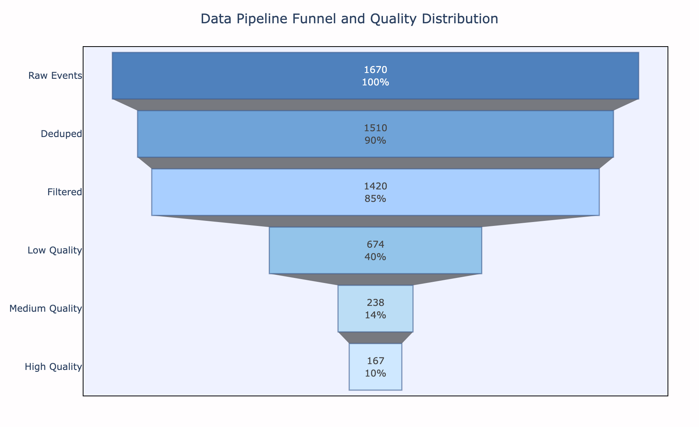
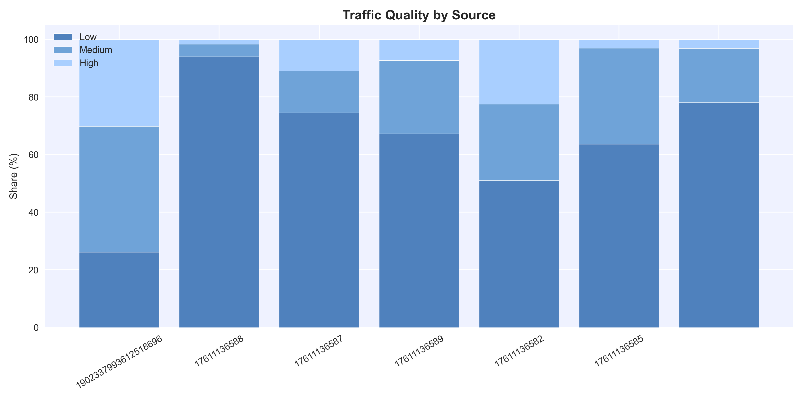
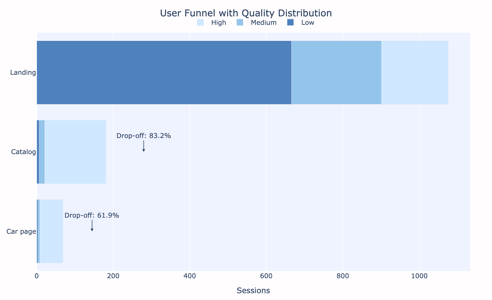
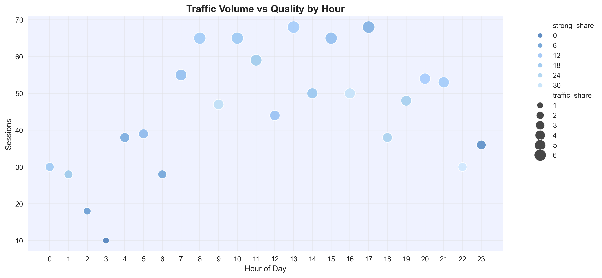
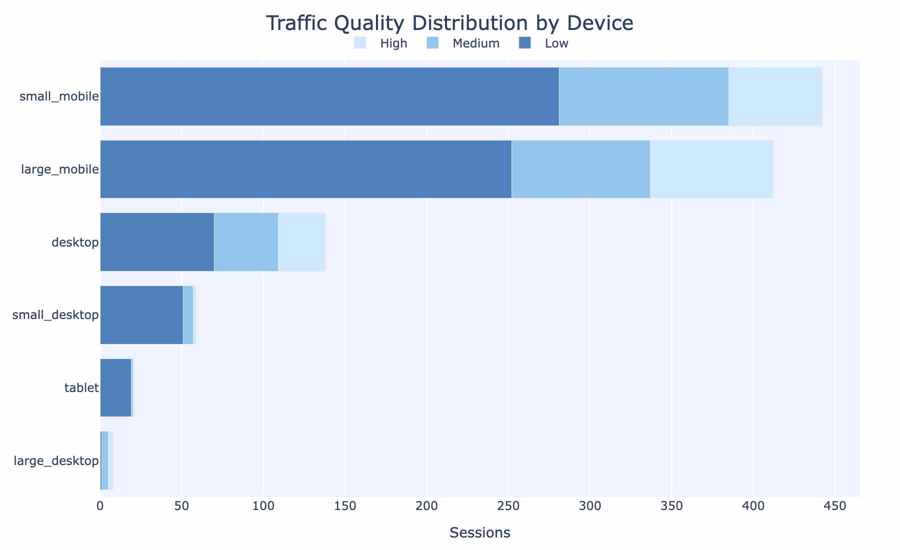

# insights.md

## 1. Data Transformation Overview

Изначально данные представляли собой сырые event-логи пользовательского поведения.

Общий объём: **1744 событий**

### Data Quality Issues

В ходе первичного анализа выявлены следующие проблемы:

- дублирующиеся события
- частично нерелевантные `event_type`, пересекающиеся по смыслу
- нестабильная структура пользовательских сессий

---

### Data Cleaning Pipeline

Для повышения качества анализа был реализован многоэтапный pipeline:

1. Исключение тестового трафика  
   - удалены события с timezone = `Asia/Bangkok`

2. Дедупликация  
   - удалены дубликаты по `session_id + timestamp + page_path`

3. Фильтрация событий  
   - оставлены только behavior-события как наиболее стабильные

---

### Session Segmentation

После очистки данные были агрегированы на уровне сессий.

Введена метрика качества сессий:

- Low quality → ≤ 5 сек
- Medium quality → 1 страница или ≥ 15 сек
- High quality → ≥ 2 страницы и ≥ 15 сек

---

### Распределение сессий

- 40% — Low quality  
- 14% — Medium quality  
- 10% — High quality  

---

### Key Insight

После очистки стало видно, что значительная часть пользовательского поведения относится к низко вовлечённым сессиям, что подтверждает необходимость дальнейшего анализа на уровне сегментации, а не сырых событий.

---

## 2. EDA — Анализ трафика

### 2.1 Общая характеристика трафика

За анализируемый период:

- 1079 сессий  
- 864 пользователя  
- 50 источников трафика  

Распределение по качеству:

- 62% — низкое  
- 22% — среднее  
- 15% — высокое  

Основной вывод: большая часть трафика не демонстрирует вовлечённого поведения, что указывает на проблему качества привлечения.

---

### 2.2 Структура источников

Трафик распределён неравномерно и сконцентрирован в нескольких каналах:

- 1902337993612518696 — ~27%  
- 17611136588 — ~17%  
- остальные источники — <5% каждый  

Около 44% всего трафика формируется двумя источниками.

---

### 2.3 Качество трафика по источникам

Ниже представлено распределение источников по объёму и качеству трафика:

---

#### Эффективные источники

**1902337993612518696**
- ~30% high-quality  
- крупнейший источник по объёму  

→ основной драйвер целевого трафика  

**17611136582**
- ~52% high-quality  
- небольшой объём  

→ перспективный источник для масштабирования  

---

#### Проблемные источники

**17611136588**
- ~94% low-quality  
- второй по объёму источник  

→ генерирует значительный объём нецелевого трафика  

**17610371267 / 17610371268**
- ~95–100% low-quality  
- низкий объём  

→ не приносят значимой ценности  

---

### 2.4 Проблемы трекинга

- ~3% трафика без `ad_placement`

→ возможны искажения в оценке эффективности источников  

---

### 2.5 Key Insights

- трафик сконцентрирован в небольшом числе источников  
- качество значительно различается между каналами  
- часть источников генерирует объём без ценности  
- есть каналы с высоким качеством, но низким объёмом  

---

### 2.6 Рекомендации

- перераспределить бюджет:
  - снизить долю **17611136588**
  - усилить **1902337993612518696**

- масштабировать источники с высоким quality-share:
  - например, **17611136582**

- провести аудит рекламной компании

- исправить трекинг (`ad_placement`)  
- продолжить сбор данных для повышения точности анализа  

---

## 3. Behavioral Analysis

### 3.1 Общая структура поведения

Основной трафик распределяется следующим образом:

- `/` — ~80%  
- `/catalog` — ~13.6%  

Поведение пользователей сильно зависит от этапа воронки.

---

### 3.2 Поведение по страницам

**Landing (`/`)**
- 1061 сессия  
- среднее время: 18 сек (медиана: 4 сек)  
- scroll depth: 24%  
- 62% low-quality  

→ основной фильтр трафика, но слабое удержание  

---

**Catalog (`/catalog`)**
- 181 сессия  
- среднее время: 27 сек  
- scroll depth: 83%  
- 88% high-quality  

→ ключевая точка вовлечения  

---

**Карточки авто**
- 63 сессии  
- scroll depth: 77–86%  
- 83–95% high-quality  

→ максимальное намерение пользователя  

---

### 3.3 User Flow

Типовой путь пользователя:

**Landing → Catalog → Car page**

- слабый трафик отсекается на первом шаге  
- вовлечённые пользователи переходят глубже  
- максимальная ценность формируется на карточках  

#### Воронка переходов

График отражает резкое снижение объёма после лендинга и рост качества на последующих этапах.

---

### 3.4 Temporal Behavior

#### По часам
- пики активности: 7–11, 13–17  
- 2–4 ночи: до 94% low-quality  

#### По дням недели
- среда/четверг: более стабильное качество  
- пятница: 38% трафика, но 85% low-quality  

#### Распределение качества по времени

График показывает, что ночной трафик преимущественно некачественный, тогда как днём доля вовлечённых пользователей выше.

---

### 3.5 Device Analysis

#### Распределение трафика и качества

Mobile является основным источником трафика (~80% sessions) и формирует общую картину поведения пользователей. При этом качество трафика на мобильных устройствах остаётся умеренным, с преобладанием low-сегмента.

Desktop обеспечивает меньший объём трафика, но демонстрирует более высокое качество: выше доля high и ниже доля low по сравнению с мобильными устройствами.

Tablet и small_desktop показывают наименее качественный трафик, однако их вклад в общий объём незначителен, поэтому влияние на общую картину ограничено.
#### Качество по устройствам

Desktop демонстрирует более высокий уровень вовлечённости при меньшем объёме трафика.

---

### 3.6 Drop-off Analysis

Основные потери происходят на ранних этапах:

- Landing → Catalog: основной отток  
- Catalog → Car page: значительное снижение объёма  

#### Потери воронки

Наибольший drop-off фиксируется до перехода в каталог, что указывает на проблему верхней части воронки.

---

### 3.7 Key Insights

- лендинг является основным узким местом  
- каталог и карточки формируют основную ценность  
- мобильный трафик даёт объём, но уступает по качеству  
- desktop — наиболее вовлечённый сегмент  
- ключевая проблема сосредоточена в верхней части воронки  

---

## 4. Conclusions (Final Insights)

### 4.1 Общая картина

Основная проблема продукта — не поведение внутри сайта, а качество входящего трафика и верхняя часть воронки.

Пользователи, которые проходят первичный фильтр, демонстрируют высокую вовлечённость.

---

### 4.2 Проблема трафика

- ~62% трафика — низкого качества
- один источник (**17611136588**) генерирует почти полностью некачественный трафик (~94%)
- только часть источников даёт действительно вовлечённую аудиторию

---

### 4.3 Воронка поведения

**Landing → Catalog → Car page**

- Landing: основной отток  
- Catalog: рост вовлечённости  
- Car page: максимальный интерес  

Проблема сосредоточена на первом этапе.

---

### 4.4 Сегментация

- Mobile — основной объём, но низкое качество  
- Desktop — наиболее качественный сегмент  
- Tablet — слабый и нерелевантный  

По времени:
- ночь (2–4) — низкое качество  
- пятница — высокий объём, но слабое качество  

---

### 4.5 Основные проблемы

1. Низкое качество входящего трафика  
2. Слабая эффективность лендинга  
3. Потери до каталога  
4. Неэффективные источники  
5. Проблемы трекинга  

---

### 4.6 Возможности роста

- улучшение качества трафика  
- оптимизация лендинга  
- масштабирование сильных источников  
- отключение слабых каналов  
- улучшение mobile UX  
- усиление сегментации  
- исправление проблем с event_type в трекинге

---

### 4.7 Итог

Продукт показывает хорошую вовлечённость пользователей после входного фильтра, однако:

> Основной ограничитель роста — качество привлечённого трафика и эффективность верхней части воронки.

Фокус должен быть смещён на:
- источники трафика
- лендинг
- таргетинг и сегментацию
